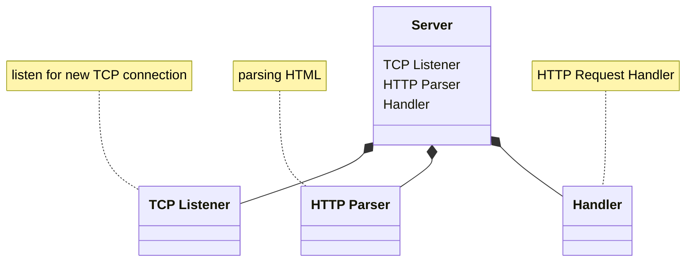

# Rust HTTP Server

Rust 언어 학습 목적으로 만드는 HTTP 웹 서버입니다.

## Architecture

```mermaid
classDiagram
    class Server {
        TCP Listener 
        HTTP Parser 
        Handler
    }

    note for `TCP Listener` "listen for new TCP connection"
    class `TCP Listener` {
       
    }

    note for `HTTP Parser` "parsing HTML"
    class `HTTP Parser` {
        
    }

    note for Handler "HTTP Request Handler"
    class Handler {
        
    }
    
    Server *-- `TCP Listener`
    Server *-- `HTTP Parser`
    Server *-- Handler
```